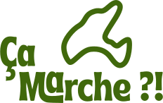

# 🥾 - Ca marche

## Table des Matières
- [🌐 - Contexte](#contexte--)
- [📊 - Description des Données](#description-des-données--)
- [🎯 - But du Projet](#but-du-projet--)
- [🔧 - Technologies Utilisées](#technologies-utilisées--)
- [📚 - Références](#références--)
- [📎 - Wireframe & Maquette](#wireframe--maquette--)

## Contexte - 🌐

"Ca marche" est une web-application conçue pour découvrir les patrimoines culturels du canton de Vaud en Suisse. À travers cette application, les utilisateurs peuvent explorer des sentiers thématiques, découvrir des points d'intérêt et obtenir des informations pratiques sur les balades. L'objectif est de promouvoir le patrimoine local et d'encourager les résidents à découvrir la richesse culturelle de la région vaudoise.

## Description des Données - 📊

Les données utilisées dans cette application sont directement disponibles dans Laravel à travers des Seeders. Les Seeders peuplent la base de données avec les informations nécessaires pour faire fonctionner l'application. Voici les principales tables disponibles :

- **Users** : Contient les informations sur les utilisateurs de l'application, y compris leur nom, email, mot de passe, rôle et photo de profil.
- **Sentiers** : Stocke les informations sur les sentiers disponibles, comme le nom, la description, la durée, la longueur, le point de départ, le point d'arrivée, la photo et le thème associé.
- **Etapes** : Contient les informations sur les différentes étapes d'un sentier, telles que le nom, la description, la latitude, la longitude et l'ordre de l'étape.
- **Points d'intérêts** : Enregistre les points d'intérêt que les utilisateurs peuvent découvrir le long des étapes, incluant le nom, la description, la latitude, la longitude et la photo.
- **Themes** : Contient les thèmes prédominants associés aux sentiers, tels que "Nature", "Historique", etc.
- **Critères** : Stocke les critères spécifiques que les sentiers peuvent satisfaire, comme "Parking disponible" ou "Mobilité réduite".
- **Mots-clés** : Gère les mots-clés associés aux sentiers pour faciliter la recherche et la classification.
- **Commentaires** : Permet aux utilisateurs de laisser des avis sur les sentiers, chaque commentaire étant associé à un sentier spécifique.

## But du Projet - 🎯

Le but de ce projet est de développer une web-application fonctionnelle qui permet de cartographier les sentiers disponibles dans la région vaudoise. Cette application vise à offrir aux utilisateurs une expérience interactive et informative, les invitant à se balader et à découvrir des points d'intérêt culturels. En facilitant l'accès à ces informations, "Ca marche" contribue à promouvoir le patrimoine local et à encourager les activités de plein air.

## Technologies Utilisées - 🔧

#### Vue
Vue.js est utilisé pour créer une interface utilisateur réactive et interactive. Il permet de développer des composants modulaires et réutilisables pour gérer les sentiers, les étapes, et les points d'intérêt.

#### Laravel
Laravel sert de back-end robuste et sécurisé. Il gère l'authentification des utilisateurs, les opérations CRUD sur les données, et les interactions avec la base de données via Eloquent ORM.

#### Mapbox
Mapbox est utilisé pour afficher les sentiers et les points d'intérêt sur une carte interactive. Il permet de créer des visualisations cartographiques attrayantes et informatives, améliorant ainsi l'expérience utilisateur.

#### Deck.gl
Deck.gl est utilisé en combinaison avec Mapbox pour créer des visualisations interactives avancées des sentiers et des points d'intérêt. Il offre des capacités de rendu performantes pour manipuler et afficher de grandes quantités de données géographiques en temps réel.

## Références - 📚

Les données utilisées dans ce projet sont principalement issues de sources locales et sont intégrées directement via les Seeders Laravel. Voici quelques ressources utilisées pour obtenir des informations supplémentaires :

- [Office du Tourisme du Canton de Vaud](https://www.region-du-leman.ch/fr/)
- [OpenStreetMap](https://www.openstreetmap.org/)
- [Wikipedia - Canton de Vaud](https://fr.wikipedia.org/wiki/Canton_de_Vaud)

## Wireframe & Maquette - 📎

La maquette du projet est disponible via le lien Figma ci-dessous. Divisée en plusieurs sections principales, la maquette présente la structure de l'application, incluant les cartes des sentiers, les détails des points d'intérêt, et les interfaces utilisateur pour la gestion des commentaires et des profils.

- [**Lien Figma - Ca marche**](https://www.figma.com/design/Ikt1KFCIzn1lloJM6sibUl/Wireframes?node-id=0%3A1&t=nbNG3kcRSLrpHLT9-1)

